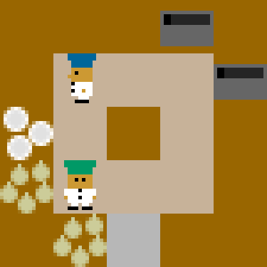
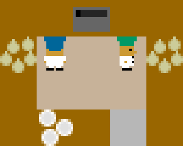
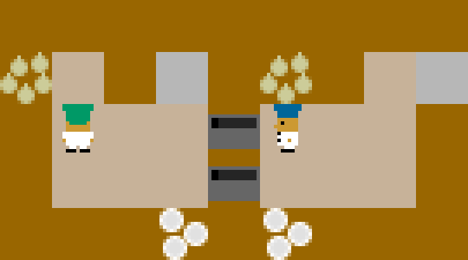
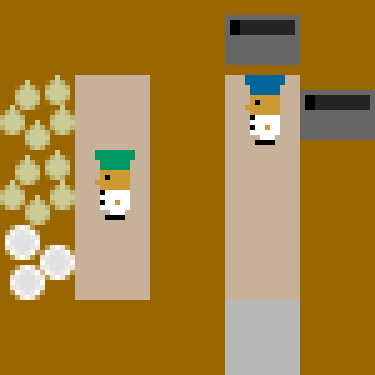
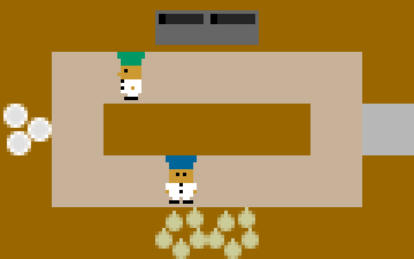

# Report

## What I did

In this lab, I basically wrap the [overcooker_ai](https://github.com/HumanCompatibleAI/overcooked_ai) environment into the [MAPPO-onpolicy](https://github.com/marlbenchmark/on-policy) package. For the interfaces codes, I mainly copied from [ZSC-Eval](https://github.com/sjtu-marl/ZSC-Eval) and adapted them to the current project.

After these, I train the 2-agent scenario under 5 layouts: [`cramped_room`](./onpolicy/envs/overcooked/src/overcooked_ai_py/data/layouts/cramped_room.layout), [`coordination_ring`](./onpolicy/envs/overcooked/src/overcooked_ai_py/data/layouts/coordination_ring.layout), [`asymmetric_advantages`](./onpolicy/envs/overcooked/src/overcooked_ai_py/data/layouts/asymmetric_advantages.layout), [`forced_coordination`](./onpolicy/envs/overcooked/src/overcooked_ai_py/data/layouts/forced_coordination.layout) and [`counter_circuit_o_1order`](./onpolicy/envs/overcooked/src/overcooked_ai_py/data/layouts/counter_circuit_o_1order.layout), all of them are able to deliver at least 5 onion soup under at most 200 steps. These are, at least, quite satisfactory to me. 

## How I reshape the rewards function

During the training, I found the agents wasting a lot of actions filling spaces with half-cooked soups, which is meaningless. As shown in the gif below.

I guessed it's because the original reward_shaping_params (prodivided by the original environment) was giving a wrong direction to the learing, leading them cooking useless soups to cheat for rewards. I therefore tune it to give higher rewards to potting and some penalty to useless cooking, which make the training process far more efficient. 

Before modifying this, I'm only able to train a agent in the `cramped_room`. But now, I'm able to train them successfully with `n_rollout_threads=20~30` and `--episode_length<=200`

The corresponding argument to pass in is `--reward_shaping_type`, if it's set to `1`, the environment will provide a better episode reward function; otherwise, it will use the original one.

## Result

The renderer seems to have some unfix bug, so the following gifs may not be fluent. Anyway, we can find the agents doing the right thing in each period.

### Cramped_room

### asymmetric_advantages

### coordination_ring

### forced_coordination

### counter
